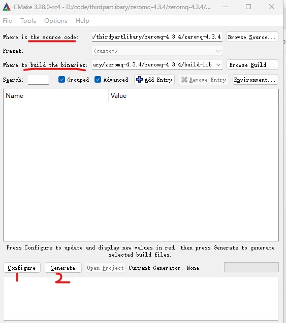
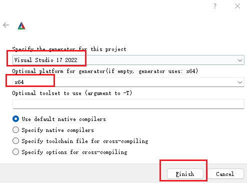
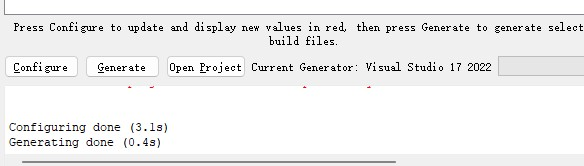
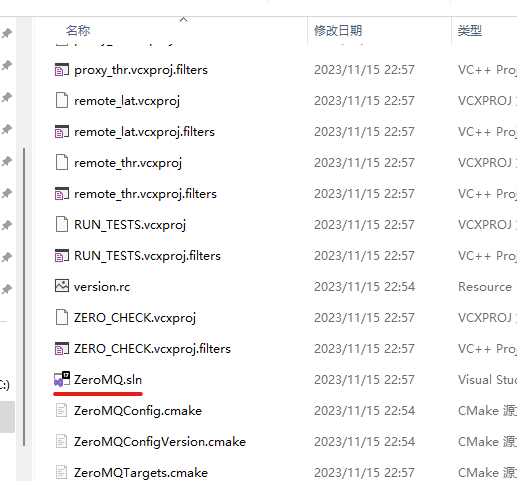
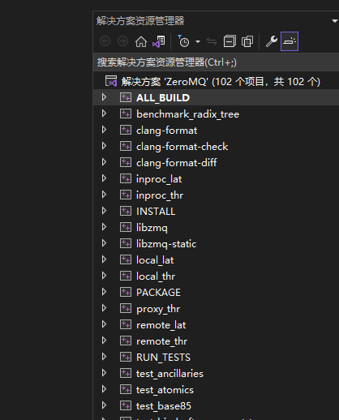
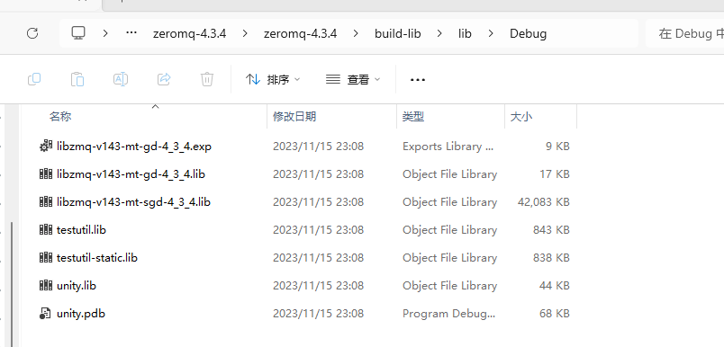

## zmq库编译

工具：

cmake-3.28.0  
visual studio 2022 
zmq 4.3.4 [下载地址](https://github.com/zeromq/libzmq/releases/tag/v4.3.4)

-----

### 编译zmq动态库

#### 1 使用cmake生成visual studio 解决方案
运行cmake-gui，界面如下，选择zmq的源码目录，以及设置好编译结果目录。然后点击Configure。

在弹出窗口中指定生成器版本为Visual Studio 2022（根据实际选择），生成平台为X64， 最后点击Finish。

Configure成功后，点击Generate，如果没有出错，提示成功。

现在cmake已经生成好了我们需要visual studio 解决方案，生成的地址在设置build目录下, 。

#### 2 打开解决方案，生成zmq项目

双击ZeroMQ.sln打开项目，或者在cmake-gui界面点击 Open Project 按钮也可以打开项目。

右击ALL_BUILD，生成项目， lib和dll文件在当前项目目录下的lib目录和bin目录下, 如下图所示，lib文件已经生成。

zmq库已经编译生成了动态库，接下来就是在vscode中使用zmq库。